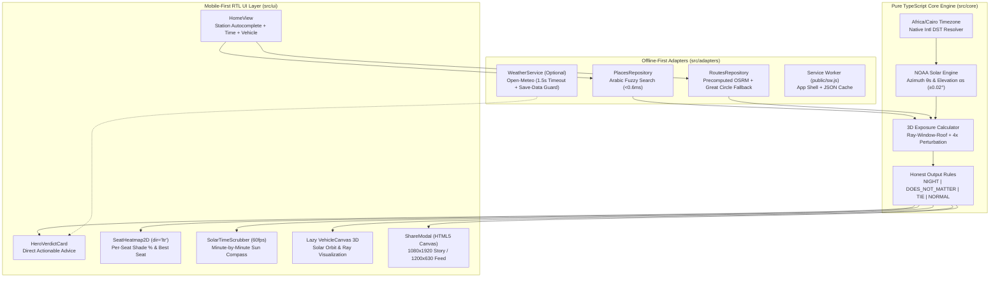

<div align="center">

# ☀️ اقعد فين؟ | Sun-Seat

**Know the shaded side and coolest seat in any Egyptian microbus or intercity bus before you board.**  
**اعرف الجنب الضل وأبرد كرسي في الميكروباص والأتوبيس في مصر في ثوانٍ ومن غير إنترنت.**

[](https://www.typescriptlang.org/)
[](https://react.dev/)
[](https://vite.dev/)
[-10B981?logo=vitest&logoColor=white)](#testing--quality-assurance)
[](#performance--bundle-budget)
[](#key-features)

[English Overview](#why-sun-seat-exists) • [المواصفات بالعربية](./00-README-ar.md) • [Architecture](./docs/architecture.md) • [Mathematical Engine](#how-the-solar--seat-exposure-math-works) • [QA Launch Report](./docs/qa-launch-report.md)

</div>

---

## Table of Contents

1. [Why Sun-Seat Exists](#why-sun-seat-exists)
2. [The Cairo–Alexandria Round-Trip Paradox](#the-cairoalexandria-round-trip-paradox)
3. [Key Features](#key-features)
4. [System Architecture](#system-architecture)
5. [How the Solar & Seat Exposure Math Works](#how-the-solar--seat-exposure-math-works)
6. [Quick Start](#quick-start)
7. [Project Structure](#project-structure)
8. [Documentation & BMAD Engineering Trail](#documentation--bmad-engineering-trail)
9. [Testing & Quality Assurance](#testing--quality-assurance)
10. [Performance & Bundle Budget](#performance--bundle-budget)

---

## Why Sun-Seat Exists

Every day, millions of commuters across Egypt travel between cities and Greater Cairo districts in **14-seat microbuses** and **49-seat intercity buses**. Picking the wrong window seat means enduring 2 to 4 hours of relentless solar radiation, while the opposite side enjoys continuous shade.

Most commuters guess based on intuition—and frequently guess wrong because:
- Highways curve and change compass bearing along the route.
- Solar azimuth and elevation shift continuously over multi-hour journeys.
- Vehicle roof overhangs block high-elevation rays at midday while letting low-angle morning and afternoon rays cut across the cabin.

**Sun-Seat (`اقعد فين؟`)** solves this in **under 4 taps** on any mobile phone—even on weak 2G/3G station networks or completely offline—with **zero external API cost**.

---

## The Cairo–Alexandria Round-Trip Paradox

One of the most counter-intuitive truths uncovered by the engine is the **Desert/Agricultural Road Round-Trip Trap**:

| Trip Leg | Departure Time (`Africa/Cairo`) | Average Bearing ($H$) | Sun Azimuth ($\theta_s$) | Relative Sun Angle ($\Delta\theta = \theta_s - H$) | Sun Strikes | Verdict |
| :--- | :---: | :---: | :---: | :---: | :---: | :---: |
| **Cairo $\to$ Alexandria** | `08:30 AM` | $\approx 320^\circ$ (NW) | $\approx 85^\circ$ (East) | $(85^\circ - 320^\circ + 360^\circ) = \mathbf{125^\circ}$ | **Right Side** | 🛡️ **Sit Left (`اقعد شمال!`)** |
| **Alexandria $\to$ Cairo** | `04:30 PM` | $\approx 140^\circ$ (SE) | $\approx 275^\circ$ (West) | $(275^\circ - 140^\circ) = \mathbf{135^\circ}$ | **Right Side** | 🛡️ **Sit Left Again (`اقعد شمال برضه!`)** |

> [!TIP]
> Commuters who sit on the **Right** in the morning get roasted by the eastern sun, then instinctively switch to the "other side" (still the vehicle's **Right** relative to its heading) on the afternoon return trip—getting roasted a second time!

---

## Key Features

- **⚡ Zero-API NOAA Solar Engine (`src/core/astronomy`)**: Pure TypeScript implementation of the NOAA / Jean Meeus astronomical equations. Accuracy within $\pm 0.02^\circ$ in `< 0.05 ms` per evaluation with zero runtime dependencies.
- **🤝 Honest Output Rules (`src/core/exposure/honest-rules.ts`)**: Never fabricates advice when the side doesn't matter:
  - **Nighttime (`NIGHT`)**: When solar elevation $\alpha_s \le 0^\circ$, displays a calm night card (`100%` shade on all seats).
  - **Summer Solar Noon (`DOES_NOT_MATTER`)**: When $\alpha_s > 68^\circ$ (Egyptian summer midday), the metal roof shields both sides equally.
  - **Winding-Road Tie (`TIE`)**: When left vs. right exposure differs by $< 5\%$.
- **🚐 Data-Driven 3D Vehicle Profiles (`public/data/vehicles/`)**: Supports both the classic **Egyptian 14-Seat Microbus** (`microbus-14.json`, 4 passenger rows + driver row) and **49-Seat Intercity Bus** (`bus-49.json`, 2+2 layout with center door) with per-seat 3D coordinates and window bounding boxes.
- **🎯 Sensitivity & Confidence Scoring**: Every trip simulation automatically runs **4 perturbation passes** ($\pm 30\text{ min}$ departure time and $\pm 20\%$ vehicle speed) to rate recommendation confidence (`HIGH` / `MEDIUM` / `LOW`).
- **🔍 Instant Colloquial Arabic Autocomplete**: Fuzzy station search (`< 0.6 ms`) supporting Egyptian Arabic aliases (`عبود`, `رمسيس`, `محرم بك`, `الموقف الجديد`, `سيدي جابر`, `العاشر`) with automatic normalization of `أ/إ/آ → ا`, `ة → ه`, `ى → ي`, and diacritics.
- **🧭 Strict RTL Physical Orientation Guard**: While the app UI is native Arabic RTL, the 2.5D seat map, 3D WebGL view, and social share cards are strictly locked to `dir="ltr"` so the driver (`LEFT`) is always on the left of the screen and the sliding door (`RIGHT`) is always on the right.
- **🌐 Lazy-Loaded 3D Solar Orbit View**: Interactive 3D vehicle + sun trajectory canvas (`src/ui/three/`) isolated behind `React.lazy` so initial page load stays ultra-light (`99.8 KB` gzipped).
- **📶 Offline-First PWA + Smart Weather Badge**: Full Service Worker precaching (`public/sw.js`), plus an optional non-blocking Open-Meteo UV/temperature badge (`1500 ms` timeout, skipped automatically on `Save-Data` or `2G`).
- **📲 Native Canvas Social Share Cards**: One-tap export of high-contrast Arabic verdict cards in **Story (`1080×1920`)** or **Feed (`1200×630`)** formats via the Web Share API.

---

## System Architecture



---

## How the Solar & Seat Exposure Math Works

### 1. Coordinate & Angle Conventions (`src/core/astronomy/noaa-solar.ts`)
- **Latitude / Longitude**: WGS84 decimal degrees (`North +`, `East +`).
- **Solar Azimuth ($\theta_s \in [0^\circ, 360^\circ)$)**: Degrees clockwise from True North ($0^\circ = \text{N}, 90^\circ = \text{E}, 180^\circ = \text{S}, 270^\circ = \text{W}$).
- **Solar Elevation ($\alpha_s \in [-90^\circ, +90^\circ]$)**: Degrees above the geometric horizon ($\alpha_s \le 0^\circ \implies \text{Nighttime}$).
- **Timezone**: Strictly resolved via IANA `Africa/Cairo` using native `Intl.DateTimeFormat`, automatically handling Egyptian Daylight Saving Time (UTC+2 winter / UTC+3 summer).

### 2. Local Vehicle 3D Frame (`src/core/exposure/exposure-calculator.ts`)
Each vehicle profile (`microbus-14.json` or `bus-49.json`) defines a 3D bounding box:
- **$X$-axis (Lateral)**: $x = 0$ is the centerline; $x < 0$ is the **Left (Driver) side**; $x > 0$ is the **Right (Door) side**.
- **$Y$-axis (Longitudinal)**: $y = 0$ is the front bumper, increasing toward the rear bench.
- **$Z$-axis (Vertical)**: $z = 0$ is ground level, increasing toward the roof ceiling.

### 3. Minute-by-Minute Ray Casting
At every 1-minute sample along the route polyline:
1. Compute instantaneous vehicle position $(\text{lat}_m, \text{lng}_m)$ and forward compass bearing $H_m \in [0^\circ, 360^\circ)$.
2. Compute solar position $(\theta_s, \alpha_s)$ and relative horizontal angle:
   $$\Delta\theta = (\theta_s - H_m + 360^\circ) \pmod{360^\circ}$$
3. Transform the solar ray into the vehicle's local 3D unit vector $(u_x, u_y, u_z)$ and trace from each passenger's seated torso $(x_s, y_s, z_s)$ to the left/right side walls ($x = \pm W/2$), checking intersection against window aperture intervals $[y_{\text{start}}, y_{\text{end}}] \times [z_{\text{bottom}}, z_{\text{top}}]$.

---

## Quick Start

### Prerequisites
- **Node.js** `>= 20.x` and **npm** `>= 10.x`

### Installation & Local Development

```bash
# 1. Install dependencies
npm install

# 2. Start the development server (http://localhost:5173)
npm run dev

# 3. Run type-checking and the full 117-test suite
npm run typecheck
npm test

# 4. Build for production
npm run build
```

### Offline Route Precomputation Script (Optional)
To add new cities in `public/data/places.json` and precompute OSRM road polylines:

```bash
# Dry run (simulates fetching first 3 route pairs)
npx tsx scripts/precompute-routes.ts --dry-run --limit 3

# Full idempotent run (skips existing files, rate-limited with retry)
npx tsx scripts/precompute-routes.ts
```

---

## Project Structure

```text
sun-seat/
├── docs/                                 # Product, UX, Architecture & Agile Story Specs
│   ├── project-brief.md                  # Analyst Project Brief
│   ├── prd.md                            # Product Requirements Document (FRs & NFRs)
│   ├── front-end-spec.md                 # RTL UX/UI & Outdoor Contrast Specification
│   ├── architecture.md                   # System Architecture & Bundle Budget Design
│   ├── qa-launch-report.md               # Final QA Audit, Math Verification & Launch Sign-Off
│   └── stories/                          # Sharded Agile Stories (1.1 through 7.2)
├── public/
│   ├── data/
│   │   ├── places.json                   # Egyptian transit hubs, cities & colloquial aliases
│   │   ├── routes/                       # Precomputed OSRM route polylines (.json)
│   │   └── vehicles/                     # 3D seat & window geometry (microbus-14, bus-49)
│   ├── models/                           # Binary GLB 3D vehicle models
│   ├── manifest.webmanifest              # RTL Arabic PWA Manifest
│   └── sw.js                             # Offline-first Service Worker
├── scripts/
│   ├── precompute-routes.ts              # OSRM polyline fetcher & Douglas-Peucker simplifier
│   └── generate-glb-models.ts            # Procedural GLB 3D asset generator
├── src/
│   ├── core/                             # Zero-dependency mathematical & domain core
│   │   ├── astronomy/                    # NOAA solar calculator & Africa/Cairo DST engine
│   │   ├── exposure/                     # 3D seat ray-casting & Honest Output Rules
│   │   ├── geometry/                     # Bearing, polyline decoder & Arabic normalization
│   │   ├── types/                        # Strict TypeScript domain contracts
│   │   └── vehicles/                     # Vehicle profile loader & validator
│   ├── adapters/                         # Offline repositories, PWA registration & weather
│   └── ui/                               # React 19 mobile-first RTL interface
│       ├── components/                   # HomeView, HeroVerdictCard, SeatHeatmap2D, etc.
│       ├── three/                        # Lazy-loaded 3D solar orbit & vehicle canvas
│       ├── store/                        # Zustand trip state & URL query sync
│       ├── i18n/                         # Egyptian Arabic & English copy dictionary
│       └── styles/                       # High-contrast outdoor design tokens & CSS
├── tests/
│   ├── unit/                             # 12 unit, integration & independent math audit suites
│   └── e2e/                              # End-to-end user flow verification
└── 00-README-ar.md .. 13-qa-launch.md    # Original BMAD Session Prompt Pack
```

---

## Documentation & BMAD Engineering Trail

This project was engineered end-to-end using the **BMAD (Breakthrough Method of Agile AI-Driven Development)** workflow. Every phase is documented and traceable:

| Phase | Session Prompt | Generated Artifact |
| :--- | :--- | :--- |
| **0. Prompt Pack Guide** | [`00-README-ar.md`](./00-README-ar.md) / [`01-context-capsule.md`](./01-context-capsule.md) | Master context & architectural guardrails |
| **1. Business Analysis** | [`02-session-analyst-brief.md`](./02-session-analyst-brief.md) | [`docs/project-brief.md`](./docs/project-brief.md) |
| **2. Product Management** | [`03-session-pm-prd.md`](./03-session-pm-prd.md) | [`docs/prd.md`](./docs/prd.md) |
| **3. UX/UI Specification** | [`04-session-ux-spec.md`](./04-session-ux-spec.md) | [`docs/front-end-spec.md`](./docs/front-end-spec.md) |
| **4. System Architecture** | [`05-session-architect.md`](./05-session-architect.md) | [`docs/architecture.md`](./docs/architecture.md) |
| **5. Story Sharding** | [`06-session-po-validate-shard.md`](./06-session-po-validate-shard.md) | [`docs/stories/1.1`](./docs/stories/1.1-sun-engine.md) – [`7.2`](./docs/stories/7.2-qa-and-launch.md) |
| **6. Core & UI Development** | [`07-dev-sun-engine.md`](./07-dev-sun-engine.md) – [`12-dev-weather-pwa-offline.md`](./12-dev-weather-pwa-offline.md) | `src/core/`, `src/adapters/`, `src/ui/`, `public/` |
| **7. QA & Launch Audit** | [`13-qa-launch.md`](./13-qa-launch.md) | [`docs/qa-launch-report.md`](./docs/qa-launch-report.md) |

---

## Testing & Quality Assurance

Run the complete verification suite with `npm test`:

- **12 Test Suites / 117 Automated Tests (`100% Passing`)**:
  - `noaa-solar.test.ts` & `timezone.test.ts`: Validates solar azimuth/elevation against NOAA reference tables and `Africa/Cairo` DST transitions.
  - `honest-rules.test.ts`: Verifies `NIGHT`, `DOES_NOT_MATTER` ($\alpha_s > 68^\circ$), and `TIE` edge cases.
  - `places-search.test.ts` & `routes-repository.test.ts`: Tests Arabic colloquial fuzzy search (`< 0.6 ms`) and polyline decoding.
  - `vehicle-profiles.test.ts` & `exposure-calculator.test.ts`: Verifies 14-seat microbus and 49-seat bus geometries and the 5 Golden Tests.
  - `ui-components.test.tsx`, `ui-store-and-url.test.ts`, `three-scene.test.ts`, `weather-pwa-share.test.ts`: Tests RTL orientation locks (`dir="ltr"`), offline resilience, and share card generation.
  - `qa-launch-audit.test.ts`: **Independent First-Principles Math Audit** (Spencer 1971 Fourier series) verifying 9 real Egyptian highway scenarios across morning, solar noon, and afternoon departures.

---

## Performance & Bundle Budget

Built for outdoor readability (`17.45:1` contrast ratio) and instant loading over congested mobile networks:

| Asset Chunk | Minified Size | Gzipped Size | Budget Target | Status |
| :--- | :---: | :---: | :---: | :---: |
| `dist/index.html` | `1.96 KB` | `0.76 KB` | `< 5 KB` | ✅ Pass |
| `dist/assets/index-*.css` | `13.45 KB` | `3.52 KB` | `< 10 KB` | ✅ Pass |
| `dist/assets/index-*.js` (Core + React + UI) | `303.75 KB` | `95.51 KB` | `< 100 KB` | ✅ Pass |
| **Total Critical Initial Path** | **`319.16 KB`** | **`99.79 KB`** | **`<= 100 KB`** | ✅ **Pass** |
| `dist/assets/VehicleCanvas-*.js` (Lazy 3D) | `12.64 KB` | `4.49 KB` | `0 KB` on load | ✅ Lazy-loaded |

---

<div align="center">

Made with ☀️ & Geometry for Egyptian Commuters • **اقعد فين؟ (Sun-Seat)**

</div>
