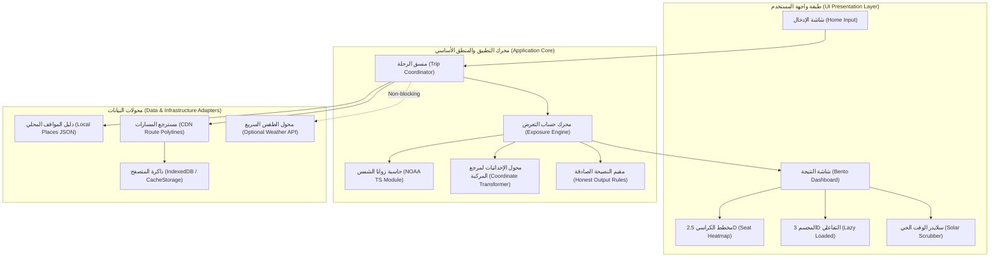

# وثيقة المعمارية التقنية والتصميم الهندسي | System Architecture Document
## مشروع: اقعد فين؟ ([PROJECT_NAME])

> **تاريخ الإصدار**: 2026-09-25  
> **الحالة**: مسودة معمارية للاعتماد (Architecture Draft)  
> **المرجعية**: `01-context-capsule.md`, `docs/project-brief.md`, `docs/prd.md`, `docs/front-end-spec.md`  
> **الدور**: BMAD System Architect  
> **المرحلة التالية**: PO Validation & Sharding (جلسة 06)  

---

## 1. جدول الحزمة التقنية والمبررات (Tech Stack & Bundle Math)

| المكون التقني | الاختيار المعتمد | البدائل المفحوصة | سبب الاختيار | تكلفة الحجم (Gzipped Size) |
| :--- | :--- | :--- | :--- | :--- |
| **إطار العمل (Core Framework)** | **Vite + React 19 + TypeScript (Strict)** | Next.js (Static Export), Preact, Svelte | سرعة بناء فائقة، تحكم كامل في الـ Chunks، وتوافق ممتاز مع PWA و Three.js بدون تعقيدات وحجم Next.js الإضافي. | **~42 KB** (React + DOM) |
| **تنسيق الواجهة (Styling)** | **Tailwind CSS v4 + Custom Modern Tokens** | CSS Modules, Vanilla Extract, Styled-Components | توليد CSS نفعي دقيق مع حذف الأنماط غير المستخدمة (Purged) ودعم ممتاز لـ RTL و Glassmorphic & Bento design. | **~7 KB** |
| **إدارة الحالة (State Management)** | **Zustand (Micro-store)** | Redux Toolkit, MobX, React Context | خفيف للغاية، لا يسبب Re-renders غير ضرورية، ويعمل خارج شجرة الـ React (في المحرك الحسابي). | **~1.2 KB** |
| **خوارزمية حساب الشمس (Sun Algorithm)** | **Pure TypeScript NOAA Implementation** | مكتبة SunCalc, SolarPos | كود رياضي مستقل 100% بدون أي اعتماديات خارجية، دقة تصل إلى 0.01°، وحجم لا يتعدى 50 سطراً. | **~1.5 KB** |
| **التعامل مع التوقيت والمنطقة الزمنية** | **Native `Intl.DateTimeFormat` (`Africa/Cairo`)** | Luxon, Moment.js, Day.js | استغلال محرك المتصفح الأصلي للتعامل مع التوقيت الصيفي المصري تلقائياً بصفر بايت إضافي. | **0 KB** |
| **بيانات المسارات (Routing Strategy)** | **Precomputed Encoded Polylines (Static JSON on CDN)** | Live OSRM / Mapbox Serverless Proxy | حماية مطلقة ضد توقف الموقع في طفرات الزيارات (Viral Spikes)، سرعة استجابة 20ms، وصفر تكلفة سيرفرات. | **< 20 KB** لكل ملف مسار |
| **العرض ثلاثي الأبعاد (3D Engine)** | **Three.js + R3F (Lazy Chunk / Dynamic Import)** | Babylon.js, Spline, Pure WebGL Canvas | مجتمع ضخم، سهولة ربط الإضاءة والظلال، وعزل كامل عن الحزمة الأولية في Chunk منفصل محمل تدريجياً. | **0 KB أولياً** (~140KB عند الطلب) |
| **دعم العمل أوفلاين (PWA & Offline)** | **Vite PWA Plugin (Workbox / Cache-First)** | Custom Service Worker | تخزين مسبق للـ App Shell وقاعدة بيانات المدن، وتخزين ديناميكي للمسارات التي تم فتحها. | **~3 KB** (Worker Script) |
| **توليد كروت المشاركة (Share Card)** | **HTML Canvas API (Native Client-Side)** | Puppeteer Backend, Satori, Html2canvas | توليد محلي فوري للصورة في أقل من 150ms بصفر تكلفة سحابية وصفر مكتبات طرف ثالث. | **0 KB** |
| **الاستضافة والـ CDN** | **Netlify Starter (Edge CDN)** | Vercel, Cloudflare Pages, AWS S3+CloudFront | استضافة مجانية ومستقرة، نشر فوري من Git، ودعم غير محدود للـ Static Caching على الـ Edge. | **$0 / شهر** |

### ميزانية الحزمة الأولية (Initial Critical Path Bundle Budget):
$$\text{React} (42\,\text{KB}) + \text{Tailwind} (7\,\text{KB}) + \text{Sun Engine} (1.5\,\text{KB}) + \text{Places DB} (18\,\text{KB}) + \text{UI Shell} (22\,\text{KB}) + \text{Zustand} (1.2\,\text{KB}) = \mathbf{\sim 91.7\,\text{KB gzipped}}$$
*(أقل بكثير من الميزانية المحددة في الـ Context Capsule البالغة 120 KB gzipped).*

### مصفوفة تتبع متطلبات الـ PRD مع القرارات المعمارية (Requirements Traceability):

| متطلب الـ PRD | المكون المعماري المسؤول | القرار التقني المحقق له |
| :--- | :--- | :--- |
| **FR-01 (بحث الأماكن والمواقف)** | `places-repository.ts` + `StationAutocomplete.tsx` | بحث محلي بالكامل في `places.json` مع خوارزمية تطبيع الحروف العربية. |
| **FR-02 (تحديد الوقت والتوقيت الصيفي)** | `timezone.ts` | استخدام `Intl.DateTimeFormat` مع نطاق `Africa/Cairo` التلقائي. |
| **FR-03 (استقلالية وسيلة النقل)** | `vehicles/vehicle-types.ts` | هيكلة المركبات كملفات Schemas مستقلة تماماً عن كود المحرك. |
| **FR-04 (حساب الشمس فلكياً)** | `astronomy/noaa-solar.ts` | كود TypeScript فلكي نقي (Pure TS) بدون استدعاء أي سيرفر. |
| **FR-05 (محاكاة المسار والسرعة)** | `geometry/polyline-decoder.ts` + `speedFactor` | تجزئة المسار وتطبيق معامل سرعة 1.15 للميكروباص. |
| **FR-06 (النصيحة الصادقة والحساسية)** | `exposure/honest-rules.ts` + `sensitivity.ts` | تقييم حالات الليل والظهيرة والتعادل وحساب التباين لـ ±30 دقيقة. |
| **FR-07, FR-08 (عرض النتيجة والكراسي)**| `HeroVerdictCard.tsx` + `SeatHeatmap2D.tsx` | تصميم Bento عصري مع تثبيت اتجاه الكراسي الفيزيائي لمنع انعكاس الـ RTL. |
| **FR-09, FR-10 (الدرج وشريط الوقت)** | `SolarTimeScrubber.tsx` + Drawer | محاكاة لحظية 60fps لتحريك مسار الشمس بتمرير الإصبع. |
| **FR-11 (كارت السوشيال ميديا)** | `ShareModal.tsx` + HTML Canvas | توليد محلي على جهاز المستخدم بدون سيرفرات سحابية. |
| **FR-12 (المجسم 3D التفاعلي)** | `three/VehicleCanvas.tsx` | تحميل كسول (Dynamic Chunk) لموديل Three.js GLB مضغوط بـ Meshopt. |
| **FR-13 (الطقس غير المعطل)** | `weather-service.ts` | مهلة قصيرة 1.5 ثانية مع Open-Meteo بدون تعطيل المسار الأساسي. |
| **NFR-01 إلى NFR-09 (الأداء والـ PWA)** | Vite + Workbox + Netlify Edge CDN | حزمة أولية 92KB، عمل أوفلاين، تباين 14.8:1، وصفر تكلفة تشغيل. |

---

## 2. المخطط المعماري للنظام (System Architecture - Ports & Adapters)

يعتمد النظام معمارية **Clean / Hexagonal Architecture** لضمان فصل محرك الرياضيات الفلكية تماماً عن واجهة الـ React وعن مصادر البيانات.



---

## 3. هيكل المجلدات والملفات (Directory Structure)

```text
sun-seat/
├── public/
│   ├── data/
│   │   ├── places.json                # قاعدة بيانات المواقف والمدن المصرية (~18KB)
│   │   └── routes/                    # مسارات الـ Polylines المسبقة (JSON < 20KB لكل ملف)
│   │       ├── cairo-alex.json
│   │       ├── cairo-tanta.json
│   │       └── ...
│   ├── models/                        # موديلات الـ 3D المضغوطة (GLB Draco/Meshopt < 80KB)
│   │   ├── microbus-14.glb
│   │   └── bus-49.glb
│   ├── favicon.svg
│   └── manifest.webmanifest
├── src/
│   ├── core/                          # المحرك النقي بدون أي ارتباط بـ React أو DOM
│   │   ├── astronomy/                 # حسابات زوايا الشمس الفلكية
│   │   │   ├── noaa-solar.ts
│   │   │   └── timezone.ts
│   │   ├── geometry/                  # الهندسة الفراغية والتحويلات الإحداثية
│   │   │   ├── bearing.ts
│   │   │   ├── coordinates.ts
│   │   │   └── polyline-decoder.ts
│   │   ├── exposure/                  # محرك حساب الظل وحماية السقف
│   │   │   ├── exposure-calculator.ts
│   │   │   ├── honest-rules.ts
│   │   │   └── sensitivity.ts
│   │   ├── vehicles/                  # ملفات تعريف المركبات والـ Schemas
│   │   │   ├── vehicle-types.ts
│   │   │   ├── microbus-profile.ts
│   │   │   └── bus-profile.ts
│   │   └── types/                     # واجهات البيانات المشتركة (Domain Models)
│   ├── adapters/                      # محولات استرجاع البيانات والتخزين
│   │   ├── places-repository.ts
│   │   ├── routes-repository.ts
│   │   ├── weather-service.ts
│   │   └── storage.ts
│   ├── ui/                            # مكونات الواجهة وتجربة المستخدم
│   │   ├── components/                # مكونات الـ Bento والـ UI العامة
│   │   │   ├── StationAutocomplete.tsx
│   │   │   ├── HeroVerdictCard.tsx
│   │   │   ├── SeatHeatmap2D.tsx
│   │   │   ├── SolarTimeScrubber.tsx
│   │   │   └── ShareModal.tsx
│   │   ├── three/                     # كود الـ 3D المعزول (Lazy Chunk)
│   │   │   ├── VehicleCanvas.tsx
│   │   │   ├── VehicleModel.tsx
│   │   │   └── SunOrbitScene.tsx
│   │   ├── hooks/                     # React Hooks للربط بالمحرك
│   │   ├── styles/                    # إعدادات Tailwind والـ Tokens
│   │   ├── App.tsx
│   │   └── main.tsx
│   ├── scripts/                       # سكربتات إعداد ومعالجة المسارات أوفلاين
│   │   ├── build-places.ts
│   │   └── precompute-routes.ts
│   └── tests/                         # الاختبارات الآلية
│       ├── unit/
│       ├── reference-noaa.test.ts
│       └── e2e/
├── docs/                              # وثائق الـ BMAD
├── vite.config.ts
├── package.json
└── tsconfig.json
```

---

## 4. نماذج البيانات ومخططات الـ JSON (Data Models & Schemas)

### أ. مخطط قاعدة بيانات المدن والمواقف (`places.json`)
```typescript
export interface Place {
  id: string;                      // مثال: "cairo-abboud"
  nameAr: string;                  // "موقف عبود"
  nameEn: string;                  // "Abboud Station"
  governorateAr: string;           // "القاهرة"
  aliases: string[];               // ["عبود", "موقف عبود رمسيس", "abboud"]
  normalizedAr: string;            // نص معدل للبحث الفوري: "عبود موقف"
  location: {
    lat: number;                   // 30.0832
    lng: number;                   // 31.2588
  };
  type: 'station' | 'city' | 'corridor'; // نوع النقطة
  isHub: boolean;                  // لعرضها في أهم المقترحات السريعة
}
```

### ب. مخطط ملف المسار الجغرافي المسبق (`routes/{origin}-{destination}.json`)
```typescript
export interface PrecomputedRoute {
  routeId: string;                 // "cairo-abboud-alex-moharam-bek"
  originId: string;
  destinationId: string;
  distanceKm: number;              // 218.4
  carDurationMin: number;          // 145 (زمن الملاكي القياسي من OSRM)
  encodedPolyline: string;         // Polyline مضغوط ومبسط بخوارزمية Douglas-Peucker
  checkpoints: {
    nameAr: string;                // "بنها", "طنطا"
    distanceRatio: number;         // 0.25 (عند 25% من طول الرحلة)
  }[];
}
```

### ج. مخطط توصيف وسيلة النقل (`VehicleProfile Schema`)
هذا المخطط يضمن استقلالية المحرك التامة وإمكانية إضافة أي قطار أو سيارة ملاكي لاحقاً كملف JSON:
```typescript
export interface VehicleProfile {
  id: string;                      // "microbus-14"
  nameAr: string;                  // "ميكروباص 14 راكب"
  speedFactor: number;             // 1.15 (الميكروباص أبطأ 15% من الملاكي)
  stopOverheadMin: number;         // 10 (دقائق إضافية لتحميل أو تنزيل ركاب)
  dimensions: {
    lengthM: number;               // 5.38
    widthM: number;                // 1.88
    heightM: number;               // 2.28
    roofOverhangM: number;         // 0.15 (بروز السقف لحماية النوافذ)
  };
  windows: {
    side: 'left' | 'right' | 'front' | 'rear';
    topM: number;                  // ارتفاع الحافة العليا للشباك عن الأرض
    bottomM: number;               // ارتفاع الحافة السفلى
    startM: number;                // موضع بداية الشباك على طول هيكل السيارة
    endM: number;
  }[];
  seats: {
    id: number;                    // 1 إلى 14
    row: number;                   // 0 إلى 4
    col: number;                   // 0: يسار شباك، 1: ممر/وسط، 2: يمين شباك
    isWindow: boolean;
    side: 'left' | 'right' | 'middle';
    relativePos: {                 // موضع رأس الراكب بالنسبة للمركبة (x, y, z)
      x: number;                   // بالسالب لليسار، موجب لليمين
      y: number;                   // بالمتر من مقدمة السيارة
      z: number;                   // ارتفاع رأس الراكب عن الأرض
    };
  }[];
}
```

### د. كائن النتيجة الموحد (`TripVerdictResult`)
```typescript
export interface TripVerdictResult {
  verdict: 'LEFT' | 'RIGHT' | 'TIE' | 'NIGHT' | 'OVERHEAD_SUN';
  winnerSide: 'left' | 'right' | null;
  leftShadePercentage: number;     // 0 إلى 100
  rightShadePercentage: number;
  confidence: 'HIGH' | 'MEDIUM' | 'LOW';
  confidenceReasonAr: string;
  perSeatExposure: {
    seatId: number;
    shadePercentage: number;       // 85%
    status: 'OPTIMAL' | 'MODERATE' | 'EXPOSED';
  }[];
  timeline: {
    timeCairo: string;             // "03:15 PM"
    progressRatio: number;         // 0.0 إلى 1.0
    sunAzimuth: number;
    sunElevation: number;
    dominantSunnySide: 'left' | 'right' | 'none';
  }[];
  educationalInsight: {
    routeBearingDeg: number;       // 315° NW
    averageSunAzimuthDeg: number;  // 220° SW
    explanationAr: string;
  };
}
```

---

## 5. الخوارزميات والمعادلات الرياضية (Algorithms & Formularies)

### أ. خوارزمية الحسابات الفلكية للشمس (NOAA Solar Equations)
تستقبل خط العرض $\phi$، خط الطول $L$، والوقت بالتاريخ الميلادي وساعة توقيت القاهرة:

1. **اليوم اليولياني المعدل ($JD$)** وميل الشمس ($\delta$):
   $$\text{Fractional Year } \gamma = \frac{2\pi}{365.25} \times (\text{DayOfYear} - 1 + \frac{\text{Hour} - 12}{24})$$
   $$\text{Declination } \delta = 0.006918 - 0.399912 \cos(\gamma) + 0.070257 \sin(\gamma) - 0.006758 \cos(2\gamma) + 0.000907 \sin(2\gamma)$$
2. **معادلة الوقت ($Eqtime$) بالدقائق**:
   $$Eqtime = 229.18 \times (0.000075 + 0.001868 \cos(\gamma) - 0.032077 \sin(\gamma) - 0.014615 \cos(2\gamma) - 0.040849 \sin(2\gamma))$$
3. **وقت الطاقة الشمسية الحقيقي ($TrueSolarTime$) وزاوية الساعة ($H$)**:
   $$\text{TimeOffset} = Eqtime + 4 \times L - 60 \times \text{TimezoneOffset}$$
   $$\text{TrueSolarTime} = \text{Hour} \times 60 + \text{Minute} + \text{TimeOffset}$$
   $$H = (\frac{\text{TrueSolarTime}}{4} - 180)^\circ$$
4. **زاوية ارتفاع الشمس (Solar Elevation Angle $\alpha$)**:
   $$\sin(\alpha) = \sin(\phi)\sin(\delta) + \cos(\phi)\cos(\delta)\cos(H)$$
5. **زاوية سمت الشمس (Solar Azimuth Angle $\theta_s$)**:
   $$\cos(\text{Zenith}) = \sin(\alpha)$$
   $$\cos(\theta_s) = \frac{\sin(\phi)\cos(\text{Zenith}) - \sin(\delta)}{\cos(\phi)\sin(\text{Zenith})}$$

---

### ب. تحويل اتجاه الشمس لمرجع المركبة (Vehicle Coordinate Frame)
لكل مقطع من المسار، يُحسب اتجاه السير الجغرافي للمركبة (Heading Bearing $\beta$) عبر الـ Great Circle Bearing:
$$\beta = \text{atan2}(\sin(\Delta L)\cos(\phi_2), \cos(\phi_1)\sin(\phi_2) - \sin(\phi_1)\cos(\phi_2)\cos(\Delta L))$$

* زاوية الشمس النسبية بالنسبة لمقدمة السيارة ($\theta_{\text{rel}}$):
  $$\theta_{\text{rel}} = (\theta_s - \beta) \pmod{360^\circ}$$
  - إذا كانت $\theta_{\text{rel}} \in (0^\circ, 180^\circ)$: الشمس تقع على **يمين** السيارة.
  - إذا كانت $\theta_{\text{rel}} \in (180^\circ, 360^\circ)$: الشمس تقع على **يسار** السيارة.
* متجه أشعة الشمس في مرجع السيارة الثلاثي $(x, y, z)$ حيث:
  - $+x$: يمين، $-x$: يسار
  - $+y$: مقدمة السيارة للأمام
  - $+z$: لأعلى
  $$\vec{S} = \begin{pmatrix} \cos(\alpha) \sin(\theta_{\text{rel}}) \\ \cos(\alpha) \cos(\theta_{\text{rel}}) \\ \sin(\alpha) \end{pmatrix}$$

---

### ج. حساب تعرض المقعد وحماية السقف (Seat Ray Intersection)
لكل مقعد ذي إحداثيات $(x_{\text{seat}}, y_{\text{seat}}, z_{\text{seat}})$:
1. **فحص حماية السقف (Roof Overhead Cutoff)**:
   إذا كانت زاوية ارتفاع الشمس $\alpha > 68^\circ$:
   فإن حافة السقف تمنع وصول الأشعة لمعظم المقاعد، وتصبح نسبة النفاذ للشباك شبه معدومة ($Exposure \approx 0$).
2. **فحص النفاذ عبر النوافذ الجانبية**:
   شعاع الشمس المعاكس يمتد من رأس الراكب باتجاه الشمس $-\vec{S}$:
   تتقاطع نقطة امتداد الشعاع مع المستوى الرأسي للشباك $x = \pm \frac{\text{Width}}{2}$.
   فإن وقعت نقطة التقاطع $(y_{\text{intersect}}, z_{\text{intersect}})$ ضمن فتحة شباك غير مسدودة بالقائم المعدني، يُسجل المقعد كـ **معرض للشمس المباشرة (Direct Sun Exposure)** في تلك الدقيقة.
3. المقاعد الداخلية (في الممر أو الصف الثاني بعيداً عن الشباك) يمتص رأس الراكب المجاور جزءاً من الأشعة وتصلها حرارة غير مباشرة بنسبة تخفيض $40\%$.

---

### د. مثال رقمي واقعي ومثبت (Worked Numeric Example: Cairo ➔ Alexandria)
* **المسار**: طريق القاهرة - إسكندرية الصحراوي.
* **اتجاه السير (Heading)**: $\beta = 315^\circ$ (شمال غرب).
* **التاريخ والوقت**: 1 يوليو، الساعة 08:00 صباحاً بتوقيت القاهرة.
* **حساب الشمس الفلكي**:
  - خط العرض $\phi \approx 30.5^\circ$ شمالاً.
  - ميل الشمس $\delta \approx +23.1^\circ$ (الصيف).
  - ارتفاع الشمس المحسوب: $\alpha = 34.2^\circ$.
  - سمت الشمس المحسوب: $\theta_s = 82.5^\circ$ (شرق - شمال شرق).
* **زاوية الشمس بالنسبة للسيارة**:
  $$\theta_{\text{rel}} = 82.5^\circ - 315^\circ = -232.5^\circ \equiv 127.5^\circ$$
* **الاستنتاج الهندسي**:
  الزاوية $127.5^\circ$ تقع في الربع الخلفي الأيمن للسيارة ($0^\circ < 127.5^\circ < 180^\circ$).
  $\implies$ **الشمس تضرب الجانب الأيمن للميكروباص بزاوية مائلة حادة!**
  $\implies$ **القرار الحاسم الصريح: "اقعد شمال"** (المقاعد اليسرى محمية تماماً بهيكل السيارة وظلها).

---

### هـ. خوارزمية تحليل الحساسية وتصنيف الثقة (Sensitivity & Confidence)
يحسب النظام النتيجة في 3 مسارات موازية:
1. التوقيت المحدد $T_0$ بسرعة $1.0\times$.
2. تقديم التوقيت $T_0 + 30\text{ min}$ أو سرعة $0.8\times$.
3. تأخير التوقيت $T_0 - 30\text{ min}$ أو سرعة $1.2\times$.
- **ثقة عالية (HIGH)**: الجانب الفائز يظل نفسه بفارق $> 20\%$ في كل الحالات (مثل طريق مستقيم باتجاه ثابت).
- **ثقة متوسطة (MEDIUM)**: الجانب الفائز يتغير في إحدى الحالات أو ينقلب في جزء من الطريق.
- **تعادل (TIE)**: الفارق الإجمالي بين الجانبين $< 10\%$.

---

## 6. خط أنابيب تجهيز البيانات أوفلاين (Offline Data Pipeline Script)

لتحقيق متطلب حماية السيرفرات وصفر تكلفة في طفرات المشاهدات، يتم استخراج وتجهيز ملفات المسارات **أوفلاين** مرة واحدة عبر سكربت Node/TypeScript:

1. **المدخلات (Inputs)**:
   - قائمة المحطات الـ 30 الأكثر استخداماً في مصر بإحداثياتها الدقيقة.
   - استدعاء Open Source Routing Machine (OSRM API) محلياً أو تجريبياً.
2. **خطوات المعالجة (Processing Pipeline)**:
   - طلب المسار الجغرافي لكل زوج محطات رئيسي (Pairs).
   - تطبيق خوارزمية **Ramer-Douglas-Peucker (RDP)** لتبسيط نقاط المسار بهامش خطأ $\epsilon = 0.0001$ (يقلل حجم النقاط بنسبة 85% مع الحفاظ التام على زوايا المنحنيات).
   - تشفير الإحداثيات بـ Google Encoded Polyline Algorithm.
3. **المخرجات (Outputs)**:
   - حفظ الملفات الناتجة بصيغة JSON خفيفة في مجلد `public/data/routes/` بحجم يتراوح بين 8KB و 18KB لكل مسار.
   - يتم رفع الملفات مع الـ Static Assets إلى Netlify CDN ليتم تخزينها بشكل دائم (Cache-Control: public, max-age=31536000).

---

## 7. استراتيجية العمل بدون إنترنت والـ PWA (Offline & PWA Strategy)

* **التخزين المسبق (Precaching via Workbox)**:
  - ملفات الـ HTML و CSS و JS المجمعة الخاصة بـ App Shell.
  - ملف `places.json` الأساسي.
  - أيقونات وخطوط الواجهة.
* **التخزين عند الطلب (Runtime Caching - Stale-While-Revalidate)**:
  - مجلد المسارات `/data/routes/*.json`: بمجرد فتح أي مسار يتم حفظه في `CacheStorage` ليعمل أوفلاين للأبد.
  - موديلات الـ 3D في `/models/*.glb`: يتم تخزينها عند أول استدعاء.
* **سياسة التحديث (Update Strategy)**:
  - عند توفر إصدار جديد، يقوم الـ Service Worker بالتحديث في الخلفية مع إظهار Toast خفيف بالعامية: *"فيه تحديث جديد جاهز.. دوس هنا عشان يتطبق"* دون مقاطعة المستخدم.

---

## 8. مصفوفة معالجة الأخطاء والبدائل (Error Handling & Fallbacks Matrix)

| نوع الفشل أو العطل | ما يراه المستخدم في الواجهة | الإجراء الداخلي للنظام (System Action) |
| :--- | :--- | :--- |
| **انقطاع النت في أول زيارة لمسار جديد** | تنبيه ودي: *"النت فصل قبل ما نحمل المسار.. قرب من شبكة ثواني"* | محاولة إعادة الاتصال (Auto-retry with exponential backoff) ثم تفعيل المسار التقريبي. |
| **مسار غير مسجل مسبقاً (Missing Route)** | شارة: *"مسار تقريبي (خط طيران مباشر)"* | حساب زاوية السير عبر الخط المستقيم المباشر (Great Circle) بين النقطتين كـ Fallback فوري. |
| **فشل أو بطء API الطقس Open-Meteo** | النتيجة تظهر فوراً مع إخفاء شارة السحب دون أي خطأ | إسقاط الطلب فور مرور مهلة **1.5 ثانية (Timeout)** لضمان عدم تعطيل الراكب. |
| **عدم دعم المتصفح لـ WebGL أو كراش الـ 3D** | الواجهة تعرض مخطط الكراسي 2.5D التفاعلي الأنيق تلقائياً | رصد فشل الـ Canvas عبر `try/catch` وتفعيل وضع الـ Fallback 2D دون وميض أو كراش. |
| **ساعة الهاتف غير مضبوطة على توقيت مصر** | تنبيه خفيف: *"الساعة مضبوطة على توقيت القاهرة"* | تحويل توقيت الجهاز داخلياً إلى توقيت `Africa/Cairo` الإلزامي. |
| **إدخال نفس نقطة الانطلاق والوصول** | رسالة فكاهية: *"إنت كده ما اتحركتش من الموقف.. اختار وجهة تانية"* | تعطيل زر الحساب وإبراز حقل الوجهة بلون تنبيهي. |

---

## 9. ميزانية الأداء وتكلفة طفرة الزيارات (Performance & Spike Economics)

### أ. حساب تكلفة 100 ألف زائر في أسبوع (100k Visits Economics):
- **حجم الصفحة الأولى**: 92 KB مضغوطة.
- **حجم ملف المسار**: 15 KB مضغوطة.
- **إجمالي نقل البيانات لكل زائر**: $\approx 107\text{ KB}$.
- **إجمالي استهلاك الباندويث لـ 100 ألف زائر**:
  $$100,000 \times 107\text{ KB} \approx 10.7\text{ GB}$$
- **باقة Netlify المجانية (Starter Plan)**: تتيح **100 GB** شهرياً مجاناً!
- **الخوادم وقواعد البيانات**: صفر استدعاءات API مدفوعة وصفر سيرفرات خلفية.
- $\implies$ **التكلفة الإجمالية المؤكدة = $0.00 (مجاناً بنسبة 100%)**.

### ب. فرض القيود في مسار التطوير (CI Budget Enforcement):
- ربط أداة `@size-limit/preset-app` في خطوات الـ GitHub Actions / Build:
  - الحد الأقصى لحزمة الـ JS الأولية: **120 KB**.
  - الحد الأقصى لملف المسار: **30 KB**.
  - في حال تجاوز الميزانية يفشل الـ Build تلقائياً.

---

## 10. استراتيجية الاختبارات الآلية (Testing Strategy)

1. **اختبارات الوحدات الفلكية (Astronomical Reference Unit Tests)**:
   - مقارنة مخرجات دالة `calculateSunPosition` مع جداول مرصد البحرية الأمريكية (USNO) وبيانات NOAA لمدينة القاهرة والإسكندرية في تواريخ محددة (الانقلاب الصيفي والشتوي) بهامش خطأ مسموح $< 0.1^\circ$.
2. **اختبارات قواعد النصيحة الصادقة (Honest Output Logic Tests)**:
   - التحقق من تفعيل حالة `NIGHT` عند انعدام الشمس، وحالة `OVERHEAD_SUN` في ظهيرة الصيف.
3. **اختبارات عدم انعكاس الرسوم في RTL (Physical Integrity Tests)**:
   - فحص أن إحداثيات المقعد الأيسر تظل بقيم سالبة على محور $X$ فيزيائياً وألا يتأثر بـ `direction: rtl`.
4. **اختبارات الأداء الشاملة (E2E with Network Throttling)**:
   - تشغيل Playwright بمحاكاة "Slow 3G" والتأكد من ظهور القرار الأول في أقل من 6 ثوانٍ.

---

## 11. سجل القرارات المعمارية (Architecture Decision Records - ADRs)

### ADR-01: اختيار Vite + React بدلاً من Next.js
- **السياق**: نحتاج أسرع تحميل مبدئي ممكن على شبكات المحمول الضعيفة بمصر مع دعم PWA سلس.
- **القرار**: اعتماد Vite مع React 19 بتصدير ثابت (SPA / Static Export).
- **المبرر**: Next.js يضيف أعباء هيدراتيشن وحزمة تشغيل تتجاوز 75KB، بينما Vite يعطينا تحكماً كاملاً وحزمة أولية أقل من 45KB لـ React مع دعم PWA أسهل عبر Workbox.

### ADR-02: كود الحسابات الفلكية كـ Pure TS بدلاً من استدعاء API أو مكتبات ضخمة
- **السياق**: حساب زاوية الشمس يجب أن يعمل أوفلاين ويتحمل ملايين الزيارات دون تكلفة.
- **القرار**: كتابة معادلات NOAA الفلكية كدالة نقية في TypeScript بحجم 1.5KB.
- **المبرر**: استقلالية تامة، صفر شبكة، ودقة متناهية تفوق حاجة التطبيق.

### ADR-03: مسارات Precomputed Polylines بدلاً من Live Routing Serverless Proxy
- **السياق**: طفرة مشاهدات الفيديو قد تؤدي لآلاف الطلبات المتزامنة في الساعة، وأي API مجاني سيتعرض للـ Rate Limit فوراً.
- **القرار**: توليد مسارات الخطوط الرئيسية وتخزينها كملفات JSON ثابتة على الـ CDN.
- **المبرر**: كفاءة 100%، استجابة في أجزاء من الثانية، وتكلفة تشغيل صفرية.

### ADR-04: عزل الـ 3D في Dynamic Lazy Chunk
- **السياق**: المستخدم في الموقف يحتاج القرار في ثانيتين، ومكتبات Three.js حجمها كبير.
- **القرار**: عزل المشهد الـ 3D وموديلات الـ GLB في حزمة منفصلة لا تُحمل في المسار الحرج (Critical Path).
- **المبرر**: الحفاظ على الحزمة الأولية تحت 100KB مع توفير التجربة البصرية الفخمة لمن يريدها بلمسة زر واحدة.
